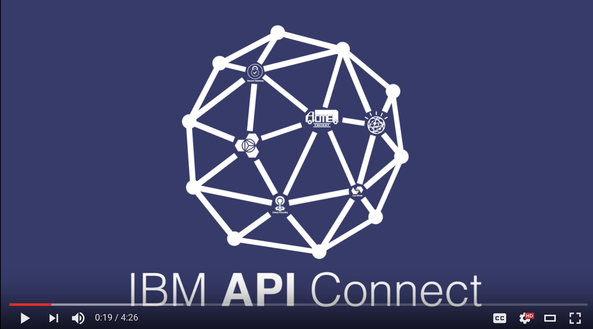
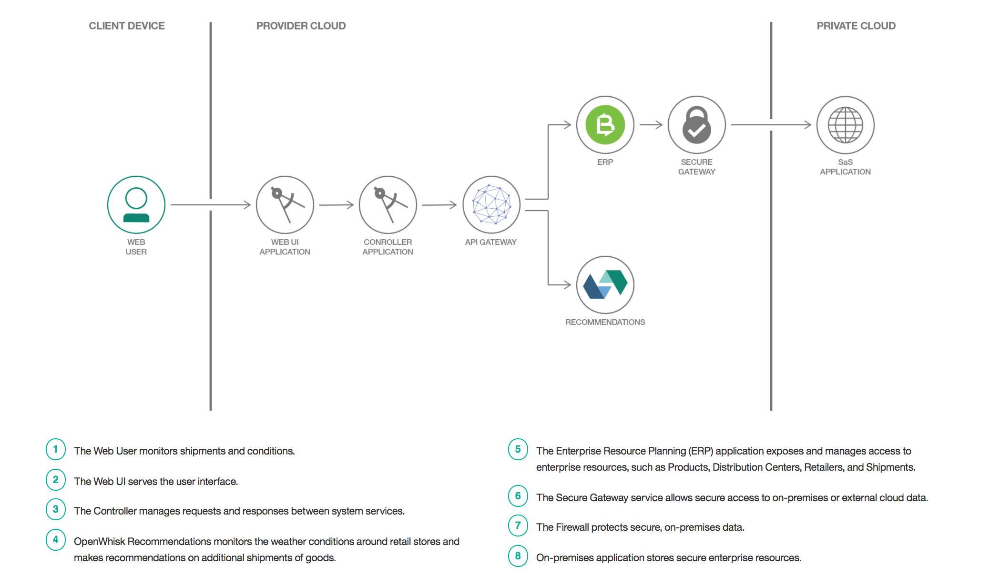

# Acme Freight Code Pattern

*阅读本文的其他语言版本：[English](README.md)。*

Acme Freight Shipping 是一家虚构的运输物流公司，它使用 [Logistics Wizard](https://github.com/ibm-bluemix/logistics-wizard) 应用程序框架重塑21世纪的供应链优化系统。

Acme Freight 使用了一个名为 [Logistic Wizard](https://github.com/ibm-bluemix/logistics-wizard) 的应用程序来管理它的一些资产。该应用程序由若干微服务组成，其中包括 3 个 Cloud Foundry 应用程序和多个 OpenWhisk Actions。

Acme Freight 使用了开源 Node.js 框架 LoopBack——一个为新的和现有的应用程序和数据快速创建并暴露 API的程序框架。LoopBack 使 Acme Freight 能够创建一个与其现有 ERP 系统集成的应用程序，而API Connect 使他们能够通过托管的 API 暴露数据。

*有关 Acme Freight Code Pattern及其相关技术的更多信息，请访问 [Acme Freight Journey网站](http://developer.ibm.com/code/journey/unlock-enterprise-data-using-apis?cm_mmc=github-code-_-native-_-acme-_-journey&cm_mmca1=000019RT&cm_mmca2=10004796)。*

## Acme Freight 教程

要进一步了解 Acme Freight 及其相关技术，请参考下面列出的教程。

### 部署 Acme Freight
* [通过 IBM DevOps Toolchain 部署您自己的 Acme Freight](TOOLCHAIN-README.md)
> 

### 利用 Node API Framework LoopBack 快速创建 API 
* [使用 LoopBack 和 API Connect 通过 API 的形式快速暴露 ERP 数据](APIC-ERP-README.md) 

### 通过几次简单的点击为 OpenWhisk Action创建安全的 API
* [在 Bluemix 上为 OpenWhisk Action创建安全的 API](OW-NAPI-README.md) 

## Acme Freight 概述
下面的视频将演示 Acme Freight 如何使用 Logistics Wizard 框架（以及 IBM API Connect）提供一个应用程序来帮助它们彻底改善其供应链的敏捷性。

## Acme Freight 架构

Acme Freight 解决方案中利用了以下项目：

* [acme-freight-erp](https://github.com/ibm/acme-freight-erp) - 定义了Acme Freight 访问 ERP 系统中的数据所需要的API。它还提供了一种默认实现来用作模拟器。该模拟器是一个连接到 PostgreSQL 数据库的 Node.js 应用程序。它通过自己的 API 来管理用户（供应链经理和零售店经理）、配送中心、零售店和运输路线。

* [acme-freight-webui](https://github.com/ibm/acme-freight-webui) - 提供一个仪表板来查看正在进行的运输和警报。无需登录或用户凭证即可使用已部署的应用程序。任何试用该应用程序的新用户都会分配一个唯一演示 ID。在每个演示 ID 背后，Acme Freight 都会创建一个隔离环境，其中包含一组默认的业务用户、配送中心、零售店和运输路线。请参阅[演练](WALKTHROUGH.md)了解相关功能。

* [acme-freight-recommendation](https://github.com/ibm/acme-freight-recommendation) - 根据天气情况来提供运输路线建议。它是一组 Bluemix OpenWhisk Actions，用于检索当前天气情况，并根据天气事件来生成新运输路线建议。然后，可以将这些建议转换为实际指令。

* [acme-freight-controller](https://github.com/ibm/acme-freight-controller) - 充当服务之间交互的主要控制器。它接收来自用户界面的请求，将它们路由到 ERP 或天气推荐模块。

*Acme Freight 是从 IBM Bluemix 项目 Logistics Wizard 复制和扩展而来。请访问 Logistics Wizard 项目 [wiki](https://github.com/IBM-Bluemix/logistics-wizard/wiki)，查看原始 Logicistics Wizard 架构和部署策略的细节。*

## 其他参考资源
  - [Acme Freight Code Pattern](http://developer.ibm.com/code/journey/unlock-enterprise-data-using-apis?cm_mmc=github-code-_-native-_-acme-_-journey&cm_mmca1=000019RT&cm_mmca2=10004796)
- [通过 LoopBack 解锁企业数据](https://developer.ibm.com/code/2017/05/04/unlock-enterprise-data-with-loopback?cm_mmc=github-code-_-native-_-acme-_-related-content&cm_mmca1=000019RT&cm_mmca2=10004796)

## 许可

参阅 [LICENSE](LICENSE) 了解许可信息。
